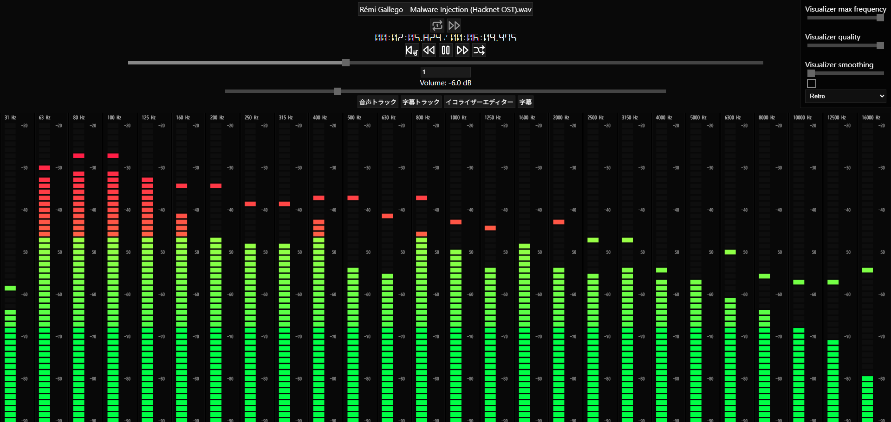
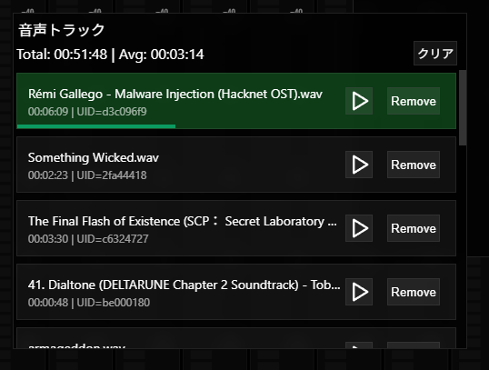
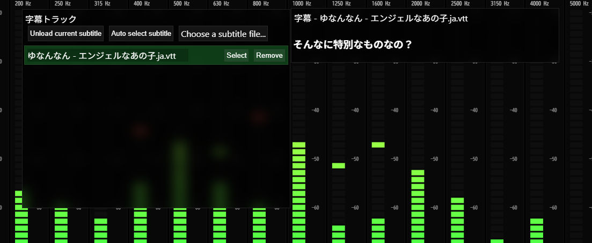
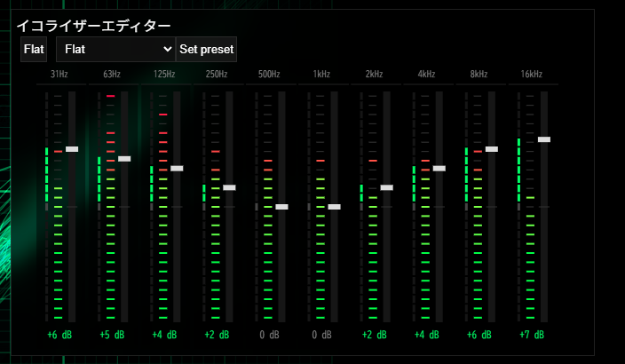
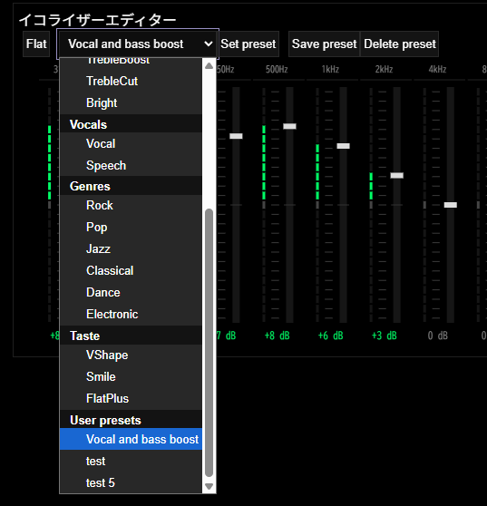
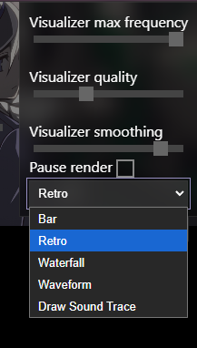
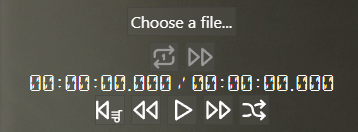

# Music-Player-Visualizer

This is a personal project I made because I was bored.

It's a music player and visualizer that allows you to play audio files, manage playlists, use an equalizer, and of course, enjoy various visualizations.

---

The project runs entirely locally, so there's no need to start a local server. Simply download the project and open it in your browser.

## The Player

### Fully Functional Playlist System

### Subtitle Support

Currently, subtitle support works with VTT files and may also work with SRT files.

The player also supports automatic subtitle selection. This works when the audio file and subtitle file have very similar names.

### Equalizer

An equalizer editor is included for audio tuning.

Several built-in presets are available, and you can also create your own settings manually.

Custom presets can be saved and reused later.

Custom presets can be found at the end of the preset dropdown.

### Analyzer and Visualizer Options

Here you can adjust settings such as the maximum frequency.

This affects the **Bar** and **Waterfall** visualization modes.

**Visualizer Quality** controls the analyzer's FFT size, which affects most visualization modes.

**Visualizer Smoothing** smooths out the analyzer data to reduce sharp changes.

**Pause Render** freezes the visualizer on its current frame without affecting audio playback.

### Playback Controls

Located at the top-center of the page, you'll find controls for:

* Loop Mode
* Play Mode
* Previous Track
* Next Track
* Play Random Track
* Play from the Beginning of the Playlist
* Play / Pause

---

### Loop Modes

The Loop button has two modes:

* Loop Once
* Loop

**Loop Once** plays the current audio track one additional time after it finishes.

**Loop** continuously repeats the current track.

---

### Play Modes

The Play Mode button has two modes:

* Auto Next
* Shuffle

**Auto Next** automatically plays the next track when the current one ends.

**Shuffle** randomly selects the next track when the current one ends.

---

### Combining Modes

The loop and play modes can also be combined.

**Loop Once + Auto Next**

Each track is played twice before automatically moving to the next track.

**Loop + Auto Next**

The entire playlist is played continuously. When the last track finishes, playback returns to the first track.

**Loop Once + Shuffle**

The current track is played twice, then a random track from the playlist is selected and played twice as well.

**Loop + Shuffle**

The current track loops continuously and never advances to another track.

# license

This project is under the [MIT License](./LICENSE)\
Copyright (c) 2026 Stefalgo

# Third-party licenses

## jsmediatags
jsmediatags is used in this project for reading media metadata.\
License: [BSD 3-Clause License](./licenses/jsmediatags.LICENSE.md)

## DSEG
DSEG fonts are used in this prooject.\
License: [SIL OPEN FONT LICENSE Version 1.1](./licenses/DSEG-LICENSE.txt)
